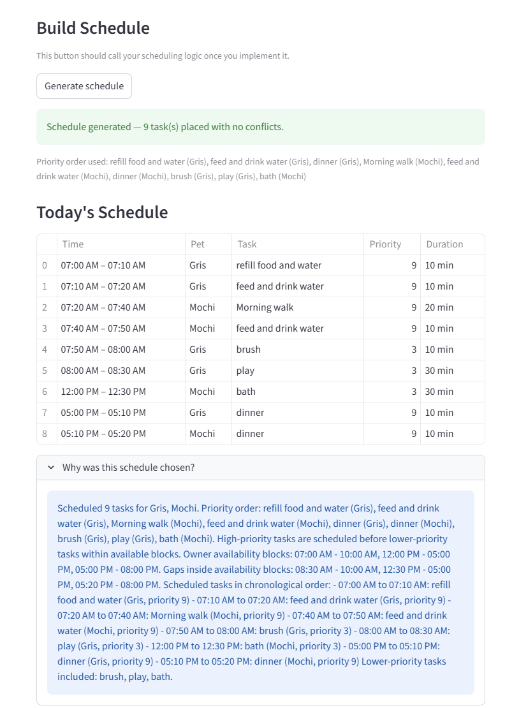

# PawPal+ (Module 2 Project)

You are building **PawPal+**, a Streamlit app that helps a pet owner plan care tasks for their pet.

## Scenario

A busy pet owner needs help staying consistent with pet care. They want an assistant that can:

- Track pet care tasks (walks, feeding, meds, enrichment, grooming, etc.)
- Consider constraints (time available, priority, owner preferences)
- Produce a daily plan and explain why it chose that plan

Your job is to design the system first (UML), then implement the logic in Python, then connect it to the Streamlit UI.

## What you will build

Your final app should:

- Let a user enter basic owner + pet info
- Let a user add/edit tasks (duration + priority at minimum)
- Generate a daily schedule/plan based on constraints and priorities
- Display the plan clearly (and ideally explain the reasoning)
- Include tests for the most important scheduling behaviors

## Getting started

### Setup

```bash
python -m venv .venv
source .venv/bin/activate  # Windows: .venv\Scripts\activate
pip install -r requirements.txt
```

### Suggested workflow

1. Read the scenario carefully and identify requirements and edge cases.
2. Draft a UML diagram (classes, attributes, methods, relationships).
3. Convert UML into Python class stubs (no logic yet).
4. Implement scheduling logic in small increments.
5. Add tests to verify key behaviors.
6. Connect your logic to the Streamlit UI in `app.py`.
7. Refine UML so it matches what you actually built.

## Features

| Feature                    | What it does                                                                                                                                                                                                                             |
| -------------------------- | ---------------------------------------------------------------------------------------------------------------------------------------------------------------------------------------------------------------------------------------- |
| **Priority-based sorting** | Tasks are ranked by priority (1–10), then alphabetically by pet name, then by preferred start time. Higher-priority tasks are always placed in the schedule first.                                                                       |
| **Preferred time windows** | Each task can declare a preferred period (Morning, Afternoon, or Evening). The scheduler only places the task inside a slot that overlaps that window.                                                                                   |
| **Greedy slot fitting**    | Available owner time is tracked as a list of free intervals. Each time a task is placed, its interval is subtracted from the free list so no two tasks can occupy the same time.                                                         |
| **Constraint filtering**   | Before scheduling begins, tasks are filtered against owner-level and task-level constraints: minimum priority threshold, pet name match, and task name pattern. Tasks that fail any constraint are silently dropped from the day's plan. |
| **Conflict warnings**      | After the schedule is built, every pair of overlapping tasks is reported by name, pet, and exact time range. The UI surfaces these as prominent warnings above the schedule table.                                                       |
| **Daily recurrence**       | Marking a daily task complete automatically creates a new instance due the following calendar day. The original task is closed; the new one is added to the pet's task list.                                                             |
| **Weekly recurrence**      | Weekly tasks are due on the same weekday each week. `isDue()` checks the current day's weekday against the task's due date so the task only appears on the correct day.                                                                  |
| **Schedule explanation**   | `explainSchedule()` produces a plain-English summary: priority order used, owner availability blocks, any free gaps left inside those blocks, a chronological task list, and a conflict count if any were detected.                      |



## Testing PawPal+

### Running the tests

```bash
python -m pytest
```

To see each test name as it runs:

```bash
python -m pytest -v
```

### What the tests cover

| Test                                                       | Area                   | What it checks                                                          |
| ---------------------------------------------------------- | ---------------------- | ----------------------------------------------------------------------- |
| `test_task_completion_marks_completed`                     | Task lifecycle         | `markCompleted()` flips `completed` to `True`                           |
| `test_pet_add_task_increases_count`                        | Pet management         | `addTask()` appends to the pet's task list                              |
| `test_recurring_task_mark_completed_creates_next_instance` | Recurrence             | Completing a daily task returns a new task due the next day             |
| `test_scheduler_complete_task_appends_recurring`           | Scheduler + recurrence | `complete_task()` marks done and adds the next instance to the pet      |
| `test_sort_tasks_returns_chronological_order`              | Sorting                | `sortTasks()` orders by priority desc → pet name → preferred start time |
| `test_daily_recurrence_due_date_advances_by_one_day`       | Recurrence edge case   | Due date advances by exactly one day regardless of weekday              |
| `test_detect_conflicts_flags_overlapping_tasks`            | Conflict detection     | Overlapping time windows produce a conflict message naming both tasks   |
| `test_detect_conflicts_no_conflict_for_back_to_back_tasks` | Conflict detection     | Adjacent tasks (end == next start) are not wrongly flagged              |

### Confidence Level

**3 / 5 stars**

The core behaviors are verified and passing. Confidence is limited for these reasons:

- `_find_fit` and `fitTasksIntoTimeSlots` (the actual slot-placement logic) are not directly tested; only the happy path is exercised indirectly through `generateDailySchedule`.
- The `notNight` and `availableWindow` constraint types have no dedicated tests, so edge cases around midnight-crossing or tight window boundaries are unverified.
- Weekly recurrence is covered by the existing `isDue` logic but has no test asserting the correct weekday behavior.
