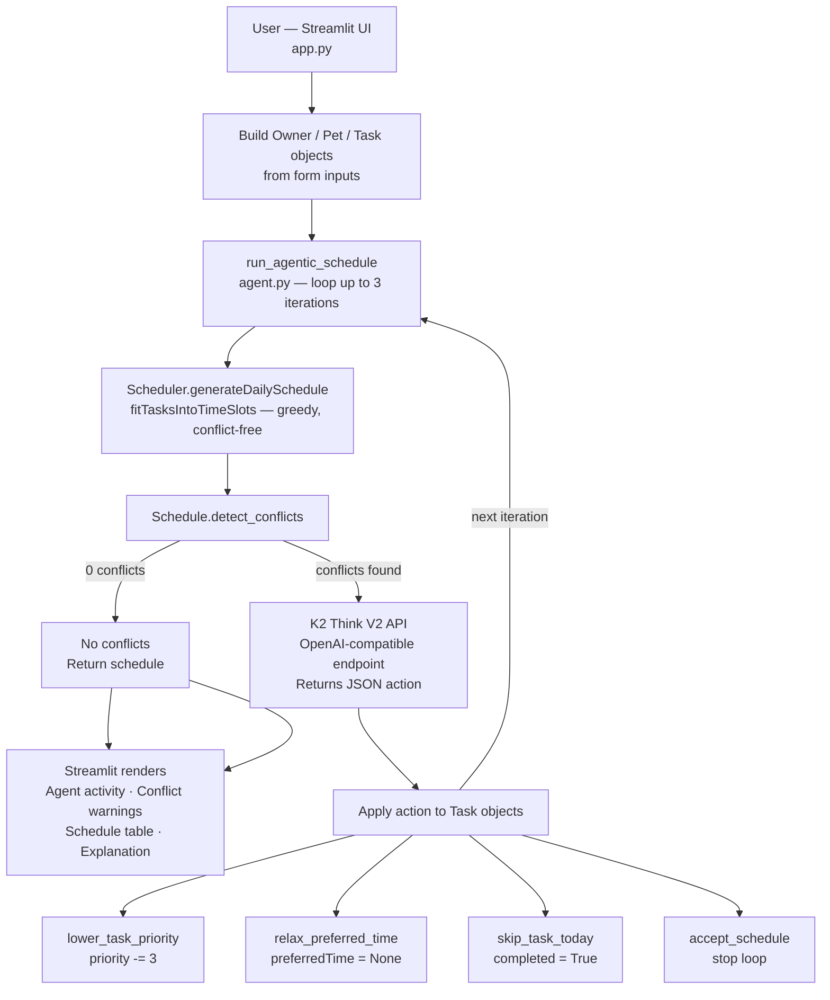

# PawPal+ with Agentic AI Scheduling

## Original Project

**PawPal+** was built across Modules 1–3 as a Streamlit pet care planning assistant. Its original goal was to help a busy pet owner stay consistent with daily pet care by tracking tasks (walks, feeding, grooming, medication), applying constraints like time availability and priority, and producing a conflict-free daily schedule with a plain-English explanation of why each task was chosen and when.

---

## Title and Summary

**PawPal+ with Agentic AI Scheduling** extends the original app with an autonomous agent that inspects the generated schedule, detects time conflicts, and resolves them by repeatedly consulting an LLM called K2 Think V2, which is a 70-billion-parameter reasoning model until the schedule is clean or the agent decides the remaining conflicts are acceptable.

This matters because real scheduling rarely works on the first try. Rather than asking the user to manually adjust task priorities or time windows when conflicts arise, the agent handles that negotiation automatically: it reads the conflict, reasons about which task should yield, takes one targeted action, and checks again just like a human planner would.

---

## Architecture Overview



**Key files:**

| File                  | Role                                                                                              |
| --------------------- | ------------------------------------------------------------------------------------------------- |
| `pawpal_system.py`    | Core domain classes: `Owner`, `Pet`, `Task`, `TimeSlot`, `Scheduler`, `Schedule`, `ScheduledTask` |
| `agent.py`            | Agentic loop, K2 API client, JSON parser, action dispatcher                                       |
| `app.py`              | Streamlit UI — form inputs, schedule display, demo conflict button                                |
| `tests/test_agent.py` | 14 tests: unit, mock, and live integration                                                        |
| `conftest.py`         | Registers the `integration` pytest marker                                                         |
| `.env`                | API key (not committed)                                                                           |

---

## Setup Instructions

**1. Clone and enter the project directory**

```bash
git clone <repo-url>
cd pawpal-starter
```

**2. Create and activate a virtual environment**

```bash
python -m venv .venv
# macOS / Linux
source .venv/bin/activate
# Windows
.venv\Scripts\activate
```

**3. Install dependencies**

```bash
pip install -r requirements.txt
```

**4. Add your K2 API key**

Create a `.env` file in the project root:

```
K2_API_KEY=your-key-here
```

The app loads this automatically via `python-dotenv`. Without a key, the Generate Schedule button still works. The agent just accepts the schedule immediately instead of calling K2.

**5. Run the app**

```bash
streamlit run app.py
```

**6. Run the tests**

```bash
# Fast mock tests only (no API calls)
pytest tests/test_agent.py -v

# Include the live K2 integration test
pytest tests/test_agent.py -m integration -v
```

---

## Sample Interactions

### 1 — Clean schedule, agent exits immediately

**Input:** One pet (Mochi, dog), three tasks in different periods.

| Task         | Duration | Priority | Preferred period |
| ------------ | -------- | -------- | ---------------- |
| Morning walk | 30 min   | High     | Morning          |
| Feeding      | 15 min   | Medium   | Afternoon        |
| Grooming     | 20 min   | Low      | Evening          |

**Agent output:**

```
Iteration 1 — No conflicts — schedule accepted as-is.
Schedule generated — 3 task(s) placed with no conflicts.
```

The scheduler places all three tasks in separate windows. The agent sees zero conflicts and returns on the first check without ever calling K2.

---

### 2 — Conflict demo (agent resolves in one K2 call)

**Input:** Click "Run conflict demo" — Walk 7:00–7:30 overlaps Feed 7:15–7:35 for Baxter.

**Agent output (real K2 API call):**

```
Iteration 1 — Relaxed time preference for 'Feed' (Baxter) from '07:00 AM – 08:00 AM'
              → any slot. Removing the preferred time window for Feed lets it be placed
              in a non-overlapping slot while preserving the high-priority Walk.
              (conflicts before: 1)

Iteration 2 — No conflicts — schedule accepted as-is.
```

**Final schedule:**

| Time                | Pet    | Task | Priority | Duration |
| ------------------- | ------ | ---- | -------- | -------- |
| 07:00 AM – 07:30 AM | Baxter | Walk | 9        | 30 min   |
| 07:30 AM – 07:50 AM | Baxter | Feed | 6        | 20 min   |

K2 chose to relax Feed's preferred time rather than skipping or lowering its priority. On the next iteration, the real scheduler placed Feed immediately after Walk, conflict-free.

---

### 3 — Two pets, shared morning slot

**Input:** Mochi (dog) and Biscuit (cat), four high-priority tasks all in Morning.

| Task         | Duration | Priority | Pet     | Period  |
| ------------ | -------- | -------- | ------- | ------- |
| Morning walk | 45 min   | High     | Mochi   | Morning |
| Feeding      | 10 min   | High     | Mochi   | Morning |
| Playtime     | 30 min   | High     | Biscuit | Morning |
| Vet meds     | 10 min   | Medium   | Biscuit | Morning |

**Agent output:**

```
Iteration 1 — No conflicts — schedule accepted as-is.
Schedule generated — 4 task(s) placed with no conflicts.
Priority order used: Playtime (Biscuit), Morning walk (Mochi), Feeding (Mochi), Vet meds (Biscuit)
```

95 total minutes fit inside the 180-minute morning window. Tasks are ordered alphabetically by pet name on equal-priority ties (Biscuit before Mochi), then by preferred start time.

---

## Design Decisions

**JSON output parsing instead of tool/function calling**

K2 Think V2 is accessed through an OpenAI-compatible endpoint, but its tool-use support was unknown at build time. Rather than risk a silent failure if structured tool calls were unsupported, the agent instructs K2 to return a plain JSON object and parses it client-side. This also makes the agent model-agnostic in the sense that any model that can follow a JSON schema works.

**Brace-counting JSON extractor**

Reasoning models like K2 sometimes wrap their output in `<think>` tags or return prose before or after the JSON object. A simple `re.findall(r'\{.*\}', text, re.DOTALL)` fails when the response contains nested braces (e.g., inside string values). The brace-counting extractor in `_extract_first_json_object` walks the characters with a depth counter and string-escape tracking, finding the exact end of the first complete JSON object even inside verbose responses.

**temperature=0**

Set to ensure K2's output is as deterministic as possible during both testing and live use. A reasoning model at non-zero temperature may choose different actions on identical inputs, making test assertions fragile.

**"First conflicting, then real" mock strategy for the UI demo**

The real scheduler never produces overlapping tasks by design. It subtracts used time before placing the next task. To demonstrate the agent visually, the demo button injects a pre-built conflicting schedule on the first call to `generateDailySchedule`, then lets the real scheduler run on subsequent iterations. This means the agent's modifications (e.g., clearing `preferredTime`) actually take effect on iteration 2, resolving the conflict rather than looping to max iterations.

**max_iterations=3**

Prevents infinite loops when K2's chosen action doesn't improve the schedule (e.g., when the mock always returns the same conflicting schedule in tests). Three iterations are enough to cover the priority: relax preferred time → lower priority → skip task.

---

## Testing Summary

**What the test suite covers**

| Category                  | Count | What it checks                                                                                                                                                            |
| ------------------------- | ----- | ------------------------------------------------------------------------------------------------------------------------------------------------------------------------- |
| Unit — `_parse_action`    | 5     | Valid JSON, `<think>` tag stripping, markdown fence stripping, embedded JSON extraction, garbage input                                                                    |
| Mock — agent loop         | 8     | Each action type applied correctly, API skipped when no conflicts, loop stops on accept, max iterations enforced, unknown task name handled, unparseable response handled |
| Integration — live K2 API | 1     | K2 returns parseable JSON and the agent either resolves conflicts, accepts, or exhausts iterations                                                                        |

**Total: 14 tests, all passing**

```
pytest tests/test_agent.py -v
14 passed in 5.94s
```

**What worked**

Mock tests were reliable from the start because they isolate the agent logic from the API entirely. The `patch.object` + `side_effect=[conflicting, clean]` pattern clearly separates "what the scheduler returns" from "what action the agent takes."

**What didn't work at first**

The integration test initially failed with `"Agent response could not be parsed"`. The root cause was the original JSON extractor: `re.findall(r'\{.*\}', text, re.DOTALL)` was too greedy. When K2 returned any text after the closing brace, the regex included it, producing invalid JSON. The fix was replacing the regex with the brace-counting extractor.

A secondary issue was the integration test assertion. It checked for `"accepted"` in the agent log, but the fallback message said `"accepting"`. After fixing the parser (so K2's real actions came through), the assertion was updated to also accept `"max iterations"` as a valid outcome, reaching the iteration limit while applying real K2 actions still proves the API integration is working.

**What could be added**

- Tests for `_find_fit` and `fitTasksIntoTimeSlots` directly (currently only exercised indirectly)
- Tests for the `notNight` and `availableWindow` constraint edge cases
- A test asserting that weekly recurrence fires on the correct weekday

---

## Reflection

The testing process, especially using mock-based unit tests in pytest, was one of the most valuable parts of this project. Writing these tests first forced me to define a clear contract for the agent: what inputs it receives, how it transforms task objects, and what it returns.

By mocking the model responses, I was able to isolate the agent’s logic from the unpredictability of the LLM. This made it much easier to reason about edge cases and validate behavior deterministically, without depending on real model outputs. Instead of testing whether the model behaved correctly, I was testing whether the system behaved correctly given a range of possible model responses.

This approach also made it easier to simulate failure scenarios, such as malformed JSON or unexpected task names, and verify that the agent handled them gracefully. Overall, mock-based unit tests helped turn what could have been a difficult-to-test system into something much more predictable and structured.
