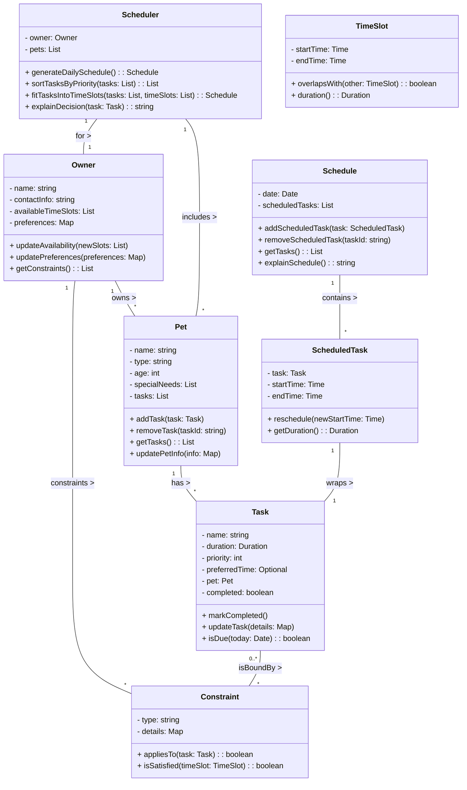

# PawPal+ Project Reflection

## 1. System Design

1. Manage Pet & Owner Information

- Users can enter and update basic details about themselves and their pets (name, type, age, special needs, etc.).
- This ensures the schedule is personalized to each pet’s needs.

2. Add and Edit Tasks

- Users can create, update, and prioritize tasks for each pet (walks, feeding, meds, grooming, enrichment).
- Each task should include at least duration and priority, and optionally constraints like time windows or frequency.

3. Generate a Daily Schedule

- The app produces a daily plan that accounts for task priorities, durations, and constraints.
- It can explain why each task was scheduled at a particular time, helping owners understand and trust the plan.

### Main Objects

#### Owner

Attributes:

- name: string
- availableTimeSlots: List<TimeSlot>
- contactInfo: string
- preferences: Map<String, Any>

Methods:

- updateAvailability(newSlots: List<TimeSlot>)
- updatePreferences(preferences: Map<String, Any>)
- getConstraints(): List<Constraint>

#### Pet

Attributes:

- name: string
- type: string (dog, cat, etc.)
- age: int
- specialNeeds: List<String> (medications, dietary restrictions)
- tasks: List<Task>

Methods:

- addTask(task: Task)
- removeTask(taskId: string)
- getTasks(): List<Task>
- updatePetInfo(info: Map<String, Any>)

#### Task

Attributes:

- name: string (walk, feeding, grooming, medication)
- duration: Duration
- priority: int
- timeConstraints: Optional<TimeSlot>
- pet: Pet
- completed: boolean

Methods:

- markCompleted()
- updateTask(details: Map<String, Any>)
- isDue(today: Date): boolean

#### Schedule

Attributes:

- date: Date
- scheduledTasks: List<SchedulerTask>

Methods:

- addScheduledTask(task: SchedulerTask)
- removeScheduledTask(taskId: string)
- getTasks(): List<SchedulerTask>
- explainSchedule(): string

#### SchedulerTask

Attributes:

- task: Task
- startTime: Time
- endTime: Time

Methods:

- reschedule(newStartTime: Time)
- getDuration(): Duration

#### Scheduler

Attributes:

- owner: Owner
- pets: List<Pet>

Methods:

- generateDailySchedule(): Schedule
- sortTasksByPriority(tasks: List<Task>): List<Task>
- fitTasksIntoTimeSlots(tasks: List<Task>, timeSlots: List<TimeSlot>): Schedule
- explainDecision(task: Task): string

#### TimeSlot

Attributes:

- startTime: Time
- endTime: Time

Methods:

- overlapsWith(other: TimeSlot): boolean
- duration(): Duration

#### Constraint

Attributes:

- type: string
- details: Map<String, Any>

Methods:

- appliesTo(task: Task): boolean
- isSatisfied(timeSlot: TimeSlot): boolean

#### Class Diagram (Mermaid)

**a. Initial design**

- Briefly describe your initial UML design.
- What classes did you include, and what responsibilities did you assign to each?

The Owner class stores the owner’s name, contact information, preferences, and a list of available time slots, and it provides methods to update availability and preferences and to return active constraints.

The Pet class stores a pet’s name, type, age, special needs, and task list, and it provides methods to add or remove tasks, return the pet’s tasks, and update the pet information.

The Task class stores task details including name, duration, priority, optional time constraints, associated pet, and completion state, and it provides methods to mark the task complete, update task fields, and check whether the task is due today.

The TimeSlot class stores a start and end time for a window, and it provides methods to check if two slots overlap and to calculate its duration.

The Constraint class stores a constraint type and details, and it provides methods to check whether a constraint applies to a given task and whether it is satisfied by a proposed time slot.

The SchedulerTask class stores a concrete scheduled task, including the source task and start/end times, and it provides methods to reschedule and calculate the scheduled duration.

The Schedule class stores one date and a list of scheduled tasks, and it provides methods to add or remove scheduled tasks, return the list, and explain the full schedule.

The Scheduler class stores the owner and their pets, and it provides methods to generate the daily schedule, sort tasks by priority, fit tasks into available time slots, and explain scheduling decisions.

**b. Design changes**

- Did your design change during implementation?
- If yes, describe at least one change and why you made it.

One key change was how I handled time constraints for tasks. Initially, I modeled this as a direct relationship between Task and TimeSlot. During implementation, I realized this added unnecessary complexity and overlap with scheduling logic. So, I simplified it by replacing that relationship with a preferredTime attribute inside the Task class. This made the model cleaner and kept the responsibility of actual time assignment within the Scheduler, where it belongs. I also adjusted the relationship between Owner and TimeSlot. Instead of modeling it as a many-to-many relationship, I simplified it to the owner just having a list of available time slots. This better reflects real-world usage and avoids overengineering.

---

## 2. Scheduling Logic and Tradeoffs

**a. Constraints and priorities**

- What constraints does your scheduler consider (for example: time, priority, preferences)?
- How did you decide which constraints mattered most?

**b. Tradeoffs**

- Describe one tradeoff your scheduler makes.
- Why is that tradeoff reasonable for this scenario?

---

## 3. AI Collaboration

**a. How you used AI**

- How did you use AI tools during this project (for example: design brainstorming, debugging, refactoring)?
- What kinds of prompts or questions were most helpful?

**b. Judgment and verification**

- Describe one moment where you did not accept an AI suggestion as-is.
- How did you evaluate or verify what the AI suggested?

---

## 4. Testing and Verification

**a. What you tested**

- What behaviors did you test?
- Why were these tests important?

**b. Confidence**

- How confident are you that your scheduler works correctly?
- What edge cases would you test next if you had more time?

---

## 5. Reflection

**a. What went well**

- What part of this project are you most satisfied with?

**b. What you would improve**

- If you had another iteration, what would you improve or redesign?

**c. Key takeaway**

- What is one important thing you learned about designing systems or working with AI on this project?
