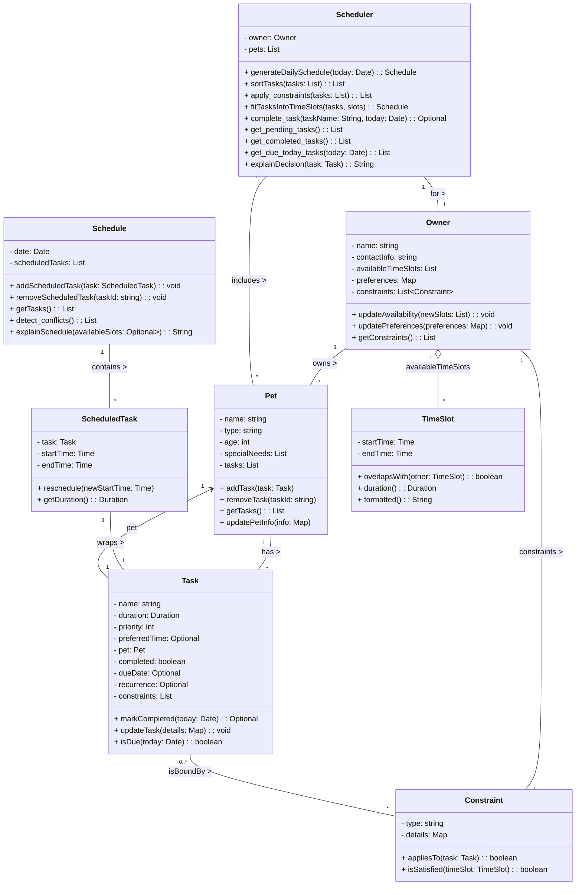

# PawPal+ Project Reflection

## 1. System Design

1. Manage Pet & Owner Information

- Users can enter and update basic details about themselves and their pets (name, type, age, special needs, etc.).
- This ensures the schedule is personalized to each pet’s needs.

2. Add and Edit Tasks

- Users can create, update, and prioritize tasks for each pet (walks, feeding, meds, grooming, enrichment).
- Each task should include at least duration and priority, and optionally constraints like time windows or frequency.

3. Generate a Daily Schedule

- The app produces a daily plan that accounts for task priorities, durations, and constraints.
- It can explain why each task was scheduled at a particular time, helping owners understand and trust the plan.

### Main Objects

#### Owner

Attributes:

- name: string
- availableTimeSlots: List<TimeSlot>
- contactInfo: string
- preferences: Map<String, Any>

Methods:

- updateAvailability(newSlots: List<TimeSlot>)
- updatePreferences(preferences: Map<String, Any>)
- getConstraints(): List<Constraint>

#### Pet

Attributes:

- name: string
- type: string (dog, cat, etc.)
- age: int
- specialNeeds: List<String> (medications, dietary restrictions)
- tasks: List<Task>

Methods:

- addTask(task: Task)
- removeTask(taskId: string)
- getTasks(): List<Task>
- updatePetInfo(info: Map<String, Any>)

#### Task

Attributes:

- name: string (walk, feeding, grooming, medication)
- duration: Duration
- priority: int
- timeConstraints: Optional<TimeSlot>
- pet: Pet
- completed: boolean

Methods:

- markCompleted()
- updateTask(details: Map<String, Any>)
- isDue(today: Date): boolean

#### Schedule

Attributes:

- date: Date
- scheduledTasks: List<SchedulerTask>

Methods:

- addScheduledTask(task: SchedulerTask)
- removeScheduledTask(taskId: string)
- getTasks(): List<SchedulerTask>
- explainSchedule(): string

#### SchedulerTask

Attributes:

- task: Task
- startTime: Time
- endTime: Time

Methods:

- reschedule(newStartTime: Time)
- getDuration(): Duration

#### Scheduler

Attributes:

- owner: Owner
- pets: List<Pet>

Methods:

- generateDailySchedule(): Schedule
- sortTasksByPriority(tasks: List<Task>): List<Task>
- fitTasksIntoTimeSlots(tasks: List<Task>, timeSlots: List<TimeSlot>): Schedule
- explainDecision(task: Task): string

#### TimeSlot

Attributes:

- startTime: Time
- endTime: Time

Methods:

- overlapsWith(other: TimeSlot): boolean
- duration(): Duration

#### Constraint

Attributes:

- type: string
- details: Map<String, Any>

Methods:

- appliesTo(task: Task): boolean
- isSatisfied(timeSlot: TimeSlot): boolean

#### Class Diagram (Mermaid)

**a. Initial design**

- Briefly describe your initial UML design.
- What classes did you include, and what responsibilities did you assign to each?

The Owner class stores the owner’s name, contact information, preferences, and a list of available time slots, and it provides methods to update availability and preferences and to return active constraints.

The Pet class stores a pet’s name, type, age, special needs, and task list, and it provides methods to add or remove tasks, return the pet’s tasks, and update the pet information.

The Task class stores task details including name, duration, priority, optional time constraints, associated pet, and completion state, and it provides methods to mark the task complete, update task fields, and check whether the task is due today.

The TimeSlot class stores a start and end time for a window, and it provides methods to check if two slots overlap and to calculate its duration.

The Constraint class stores a constraint type and details, and it provides methods to check whether a constraint applies to a given task and whether it is satisfied by a proposed time slot.

The SchedulerTask class stores a concrete scheduled task, including the source task and start/end times, and it provides methods to reschedule and calculate the scheduled duration.

The Schedule class stores one date and a list of scheduled tasks, and it provides methods to add or remove scheduled tasks, return the list, and explain the full schedule.

The Scheduler class stores the owner and their pets, and it provides methods to generate the daily schedule, sort tasks by priority, fit tasks into available time slots, and explain scheduling decisions.

**b. Design changes**

- Did your design change during implementation?
- If yes, describe at least one change and why you made it.

One key change was how I handled time constraints for tasks. Initially, I modeled this as a direct relationship between Task and TimeSlot. During implementation, I realized this added unnecessary complexity and overlap with scheduling logic. So, I simplified it by replacing that relationship with a preferredTime attribute inside the Task class. This made the model cleaner and kept the responsibility of actual time assignment within the Scheduler, where it belongs. I also adjusted the relationship between Owner and TimeSlot. Instead of modeling it as a many-to-many relationship, I simplified it to the owner just having a list of available time slots. This better reflects real-world usage and avoids overengineering.

---

## 2. Scheduling Logic and Tradeoffs

**a. Constraints and priorities**

- What constraints does your scheduler consider (for example: time, priority, preferences)?
- How did you decide which constraints mattered most?

My scheduler considers the owner's availability which is listed in time blocks, meaning a task will not be scheduled outside these windows. High priority tasks are scheduled first within the time blocks. Owners also have the option to select preferences to do a task (e.g. evening walk in the evening so it doesn't get scheduled in the morning nor afternoon). Individual tasks can carry additional constraints (e.g., only apply to a specific pet, or require a minimum priority level) that act as a final filter before a placement is confirmed. Lastly, a slot must be long enough to hold the task's full duration. Slots that are too short are ignored even if they fall within the owner's availability.

**b. Tradeoffs**

- Describe one tradeoff your scheduler makes.
- Why is that tradeoff reasonable for this scenario?

For the \_find_fit() function in the Scheduler class, it originally had nested logic and repeated constraint checks. It originally had a can_fit() helper method that recomputes things I'm already computing later. That tradeoff sounds reasonable because not only the code is more readable but it also reduced time complexity by removing nested logic.

---

## 3. AI Collaboration

**a. How you used AI**

- How did you use AI tools during this project (for example: design brainstorming, debugging, refactoring)?
- What kinds of prompts or questions were most helpful?

I used Copilot and Claude throughout the project for design brainstorming, debugging, and refactoring. In the early stages, I used AI to help brainstorm the system design, including identifying the main classes and their responsibilities. As I started implementing the scheduler, I relied on AI to debug issues where the logic was technically correct but produced unexpected or unintuitive results, such as tasks being scheduled in ways that didn’t align with real-world expectations. I also used AI to refactor and simplify algorithms, especially in areas like fitting tasks into time slots and generating explanations. AI helped me identify places where my logic was overly complex or repetitive and suggested cleaner, more readable approaches.

The most helpful prompts were specific and structured, especially when I clearly described both the problem and the desired outcome.

**b. Judgment and verification**

- Describe one moment where you did not accept an AI suggestion as-is.
- How did you evaluate or verify what the AI suggested?

---

## 4. Testing and Verification

**a. What you tested**

- What behaviors did you test?
- Why were these tests important?

I wrote eight tests covering three core areas of the scheduler.

For **task lifecycle**, I tested that `markCompleted()` correctly flips the `completed` flag, and that `addTask()` adds to the pet's task list. These were important because the rest of the system depends on completed tasks being excluded from the daily schedule — if that flag wasn't set correctly, tasks would repeat forever or never clear.

For **recurrence**, I tested that completing a daily task returns a new task due exactly the next calendar day, and that the scheduler's `complete_task()` method appends that new instance to the pet. I also specifically tested on a Sunday to make sure there was no weekday bias. These tests mattered because recurrence is easy to get subtly wrong — off-by-one errors in date math would silently produce a task due on the wrong day.

For **sorting**, I tested that `sortTasks()` returns tasks in priority-descending order, breaking ties by pet name then preferred start time. This was important because the entire scheduling algorithm depends on sort order — if high-priority tasks weren't placed first, lower-priority tasks could take the best time slots.

For **conflict detection**, I tested two boundary cases: overlapping tasks should produce exactly one conflict message naming both tasks, and back-to-back tasks (where one ends exactly when the next begins) should produce no conflict. The back-to-back case was especially important because the conflict check uses a strict `<` comparison, and getting that boundary wrong would flood the owner with false warnings.

**b. Confidence**

- How confident are you that your scheduler works correctly?
- What edge cases would you test next if you had more time?

I'm moderately confident (about 3 out of 5). The behaviors I tested all pass and cover the logic a pet owner interacts with most directly. However, I'm less confident in the parts I didn't test directly. The slot-fitting algorithm (`_find_fit` and `fitTasksIntoTimeSlots`) is only exercised indirectly through `generateDailySchedule`, so I haven't verified edge cases like a task that exactly fills the last remaining slot, or two tasks with overlapping preferred windows competing for the same interval.

If I had more time, the next tests I would write are:

- A task whose duration exactly equals the remaining free time — does it fit or get dropped?
- Weekly recurrence: a task with `recurrence='weekly'` should only appear on the matching weekday and be absent on all other days.
- The `notNight` constraint with a task that starts just before 10 PM — verifying the boundary is enforced correctly.
- Completing the same task twice — the second call should be ignored and should not spawn a second recurring instance.

---

## 5. Reflection

**a. What went well**

- What part of this project are you most satisfied with?

I'm satisfied I got the core scheduling logic working properly on both the frontend and backend. It recognizes overlapping tasks and potential conflicts. On the backend specifically, it does a great job with scheduling within the owner's availability. I'm proud that I was able to use AI to correct minor bugs I saw in the UI and now the schedule is more easier to understand.

**b. What you would improve**

- If you had another iteration, what would you improve or redesign?

For the UI, I would've loved to add more features such as inputting availability instead of solely having it in the backend. Another minor thing I would improve is the format of the explanation because everything is in one paragraph and depending on the number of tasks being added it can be a lot to take in.

**c. Key takeaway**

- What is one important thing you learned about designing systems or working with AI on this project?

While working on the scheduling logic, I realized that even when the system produced a technically correct schedule, it could still feel “wrong” if it didn’t align with human expectations, such as how time blocks are interpreted or how tasks are explained. This became especially clear when the explanation didn’t match the actual scheduling behavior. I also learned that when working with AI tools like Copilot, being very specific in prompts is crucial. Vague instructions led to unclear or misleading explanations, but once I clearly defined structure, constraints, and expected output, the results improved significantly.
